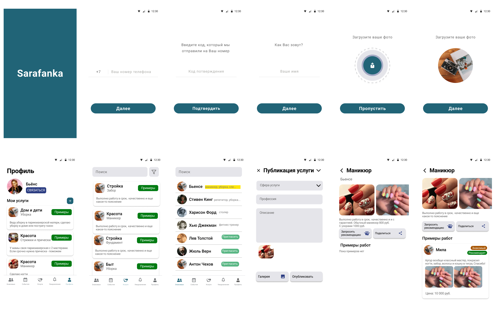

# Sarafanka

MVP of startup for sharing services between familiars in your contacts. 

UI designed by me in Figma

*Developing this app has stopped because analysis has shown that idea is not actual*

Some part of code may looks terrible but this project has a good examples of using Firebase (Glide + FireStorage), Coroutines,Kodein and Navigation Component. It just MVP which stopped before release.

